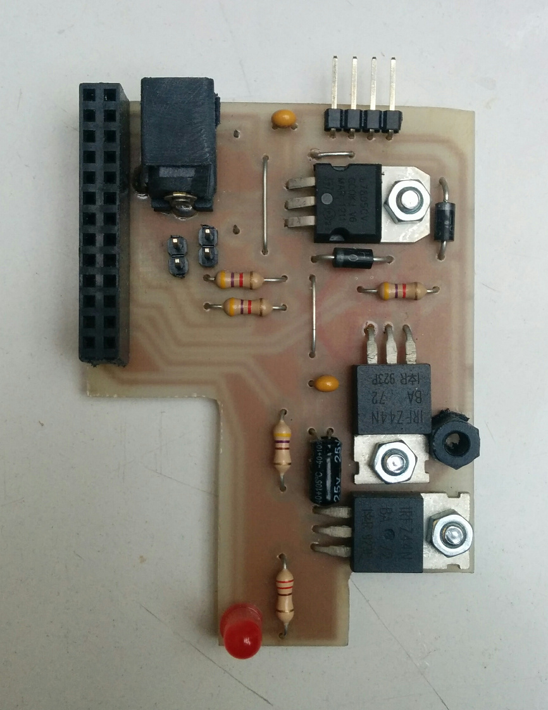

# dlock13

Breakout design (in EAGLE) and source code for our door lock, running on a Raspberry PI.
Does not contain user interface, check [door-web](https://github.com/bitraf/door-web) for that.

The board has two MOSFETS for driving standard electronic locks.
Expansion for two inputs also exists.

Single-sided board with through-hole components, can easily be CNC milled or etched.
